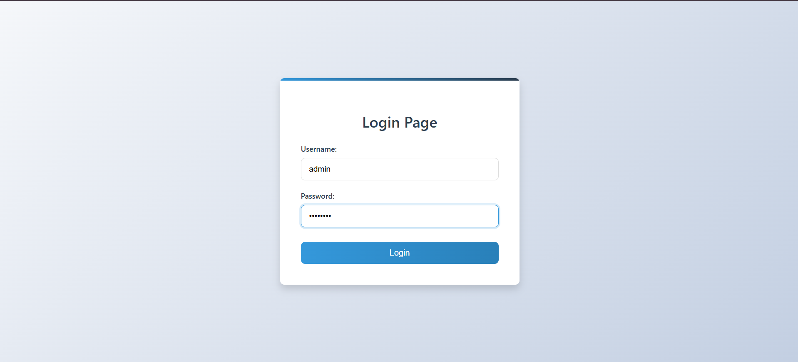
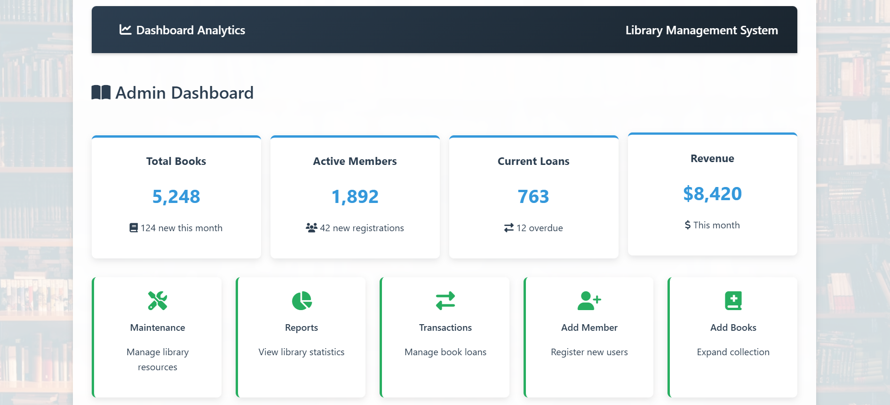
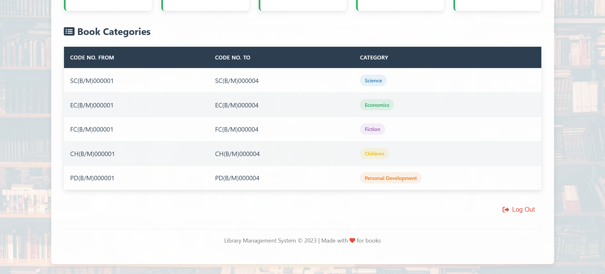
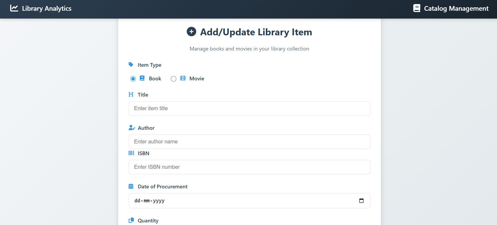
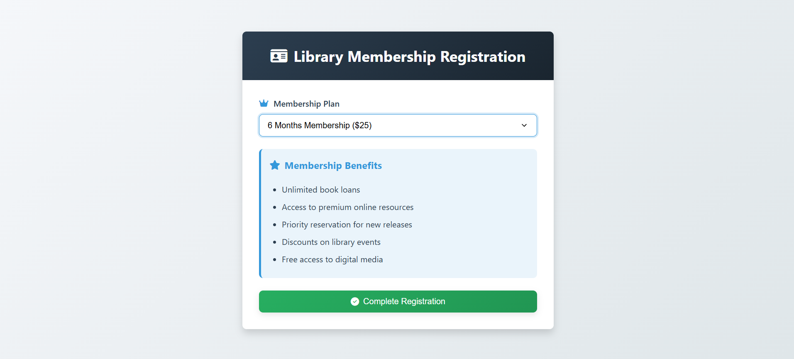

# 📚 Library Management System (Web-Based)

A full-stack web application for managing library operations like book/movie management, membership, fines, and user/admin roles. Built using Flask and MySQL.

---

## 🚀 Features

- 🔒 Role-based login for Admin and Users
- 📚 Add/Update/Delete Books and Movies
- 🧾 Manage Memberships and Fine Payments
- 🧑‍💼 Admin Dashboard with maintenance access
- 📊 Clean UI with responsive design

---

## 🎯 Tech Stack

- **Frontend**: HTML, CSS, JavaScript  
- **Backend**: Python (Flask)  
- **Database**: MySQL  
- **Tools**: Git, VS Code, XAMPP

---

## 📸 Screenshots

### 🔐 Login Page


---

### 🏠 Admin Dashboard



---

### 📚 Add Book/Movie Page


---

### 👥 Membership Management


---

### 💰 Fine Payment


---

## ⚙️ How to Run Locally

```bash
# Clone the repo
git clone https://github.com/farhannaim21/Library-Management-System.git
cd Library-Management-System

# Set up virtual environment (optional)
python -m venv venv
source venv/bin/activate  # or venv\Scripts\activate on Windows

# Install dependencies
pip install -r requirements.txt

# Run the Flask server
python app.py

```

---
## 🙌 Acknowledgments

Made with ❤️ by [Mohd Farhan Naim](https://www.linkedin.com/in/mohd-farhan-naim-5b66642bb/)

